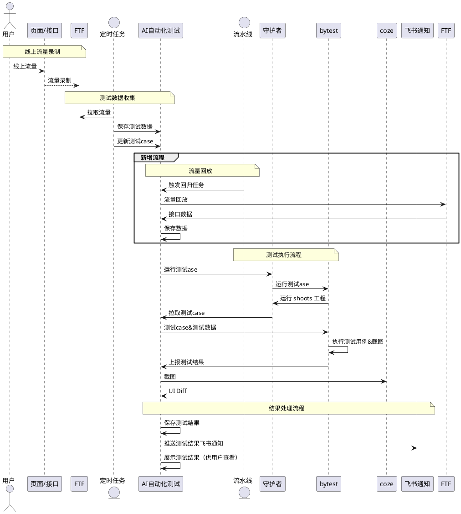

<title>【技术方案】订单 E2E 测试</title>

# 背景

<blockquote>
<cite doc-id="ChO8wdnAqixZe2k8x7fcK2S0nDe" file-type="wiki" title="交易FE-25年线上问题分析" type="doc"></cite> <cite doc-id="CtJywINgcivSUbkiBsJcRXqzn0g" file-type="wiki" table-id="tbluEVU9yyCrsJHn" title="25Y订单域线上问题分析" type="doc" view-id="vewLpaik8g"></cite>
</blockquote>

订单域 25 年因代码逻辑问题导致卡片/按钮不展示 5 次，导致用户无法核销/退款，导致用户进线。比如：

- <cite doc-id="LdAIwGn02icD5Kkn4xacjoWfnMW" file-type="wiki" title="【2025.06.11】【Notice】【生活服务-交易C】低价通兑无法兑换/核销" type="doc"></cite>
- <cite doc-id="Yd2ewUvlKiHdLdk3cp5c3HxfnKh" file-type="wiki" title="【2025.8.19】【CaseStudy】【交易C】核销模块重构导致通兑订单详情不展示退款按钮" type="doc"></cite>

<okr cycle-id="7585025918345039482" cycle-name="2026 年 1 月 - 3 月" user-name="刘韬"><okr-objective objective-id="7589863951220969083" percent="0" score="0" status="unset">
【质量基线】完成订单页回归能力 mvp 版本建设，渲染展示类线上问题数 &lt;=1
<okr-progress>

</okr-progress><okr-key-result key-result-id="7591853960164789883" percent="0" score="0" status="unset">
能力建设：建设业务身份维度下自动采集测试订单数据、自动化测试、UI diff、查看测试结果、回放 case 等能力。
<okr-progress>

</okr-progress></okr-key-result><okr-key-result key-result-id="7594292620596104829" percent="0" score="0" status="unset">
业务落地：落地综合行业，综合行业全玩法覆盖覆盖率100%，线上问题拦截率80%，渲染展示类线上问题漏放数 &lt;= 1
<okr-progress>

</okr-progress></okr-key-result></okr-objective></okr>

# 目标

- 建设自动化测试能力，避免出现**卡片/按钮**不出现类问题。
- 支持线上流量采集，支持业务身份多维度叉乘流量采集。
- 支持自动截图&图片对比，召回潜在问题。

# 使用说明

<whiteboard token="QE8MwU2CohIJbobnF2YcdVkunXl"></whiteboard>

## 任务信息

<table><colgroup><col/><col/><col/><col/><col/></colgroup><thead><tr><th>配置项</th><th>key</th><th></th><th>是否必填</th><th>说明</th></tr></thead><tbody><tr><td>过滤项</td><td>filter</td><td><pre caption="&#xA;" lang="TypeScript"><code>{    biz_identity_main_type: string;   biz_identity_combo_biz?: string[];   biz_identity_first_industry: string;   biz_identity_second_industry: string;   biz_identity_third_industry: string; }</code></pre></td><td>是</td><td><ul><li>筛选测试范围</li><li>支持通过业务身份筛选</li></ul></td></tr><tr><td>环境信息</td><td>env_info</td><td><pre caption="&#xA;" lang="TypeScript"><code>{      ppe_env: 'ppe_xx',  }</code></pre></td><td>是</td><td><ul><li>如果输入 bits 链接则自动获取，否则手动填写</li><li>bits 流水线触发，自动从流水线的上下文信息获取</li></ul></td></tr><tr><td>开发信息</td><td>task_info</td><td><pre caption="&#xA;" lang="TypeScript"><code>{     bits_url: string;     meego_url: string; }</code></pre></td><td>否</td><td><ul><li>用户输入 bits 链接/meego 链接后自动获取相关信息</li><li>bits 流水线触发，自动从流水线的上下文信息获取</li></ul></td></tr></tbody></table>

## 触发时机

<table><colgroup><col/><col/><col/></colgroup><thead><tr><th>触发方式</th><th>触发时机</th><th>说明</th></tr></thead><tbody><tr><td>bits 流水线</td><td><ul><li>火车完成集成后，准备发布前</li></ul></td><td>提供原子节点，原子节点内部调用 http api 触发任务，鉴权方式  jwt-token </td></tr><tr><td>手动触发</td><td></td><td></td></tr></tbody></table>

## 测试结果展示

> https://life-e2e-optimus.gf.bytedance.net/platform-tasks/compare?ehome_job_ids=2343272%2C2343266

# 技术方案

## 术语解释

<table><colgroup><col/><col/><col/><col/></colgroup><tbody><tr><td>FTF 平台</td><td rowspan="3">基建团队</td><td>线上流量录制和流量回放平台</td><td><cite doc-id="NyNKwXcaki9CiTkuy1TcGMaYnjd" file-type="wiki" title="FTF2.0 流量回放 One Page | FTF2.0 Traffic Playback One Page" type="doc"></cite></td></tr><tr><td>流量回放</td><td>将线上流量在指定环境重新发起接口请求，获取新的接口返回</td><td></td></tr><tr><td>nario 平台</td><td>消费 FTF 线上流量，多维度分类聚会</td><td><cite doc-id="MpBcd9dEUo7GZSxO6p7cQO24nUd" file-type="docx" title="业务场景平台Nario One Page" type="doc"></cite></td></tr><tr><td>守护者平台 ehome</td><td>电商团队</td><td>电商移动端 UI 自动化解决方案平台</td><td><cite doc-id="I3H3w8IRVigVfkkVnZ9cSiT7nOb" file-type="wiki" title="守护者平台能力导航" type="doc"></cite></td></tr><tr><td>AI 智能化平台</td><td>交易 client 团队</td><td>基于 AI 的自动化解决平台</td><td><cite doc-id="Dp7pwEr4zias3Pk4yGbcywLOnrg" file-type="wiki" title="AI智能测试-Onepager" type="doc"></cite> </td></tr></tbody></table>

## 整体设计

架构设计

<callout emoji="🎯">
串联 AI 智能化平台和 FTF 平台，以实现端到端测试， 同时满足订单 E2E 测试场景下 低维护成本+高场景覆盖 的诉求。
</callout>

<whiteboard token="Y155wViQrhm0Y4bfC3VcHQ8fnie"></whiteboard>

流程设计

<callout emoji="🎯">
通过 FTF 平台采集真实的数据，通过 AI 智能测试平台验证效果。
</callout>

<whiteboard token="QLZtwehoThGeCzbRVhwcnZLBnr2"></whiteboard>

时序图

##  测试设计

<whiteboard token="PPtJwYbUmhnIbibVwPocOm2mngh"></whiteboard>

###  数据采集&回放

<callout emoji="🎯">
由于目前场景流量覆盖有限，短期使用方案二，长期推动场景流量的覆盖
</callout>

方案一：FTF 流量回放

<table><colgroup><col/><col/><col/></colgroup><thead><tr><th>事项</th><th>逻辑</th><th>相关文档</th></tr></thead><tbody><tr><td>线上流量采集</td><td><ol><li seq="1">监听 FTF 采集到的线上流量</li><li>处理接口数据，解析出业务身份</li></ol><pre caption="&#xA;" lang="TypeScript"><code>order_detail.user_order.order_meta.biz_identity</code></pre><ol><li>保存数据</li></ol></td><td><cite doc-id="WzriwywhCiUka0k6fEicWtYPntg" file-type="wiki" title="FTF2.0 OpenAPI" type="doc"></cite> <cite doc-id="doxcn5c61y7FPhkN6DhoofEszqe" file-type="docx" title="业务场景平台Nario使用手册" type="doc"></cite></td></tr><tr><td>流量回放</td><td><ol><li seq="1">调用 FTF 接口，创建流量回放任务</li><li>轮询任务状态</li></ol></td><td></td></tr><tr><td>保存回放数据</td><td><ol><li seq="1">获取流量回放后的接口数据</li><li>同步到任意门</li></ol></td><td><a href="https://cloud.bytedance.net/docs/bits/docs/6480709f2207580224c6b2d2/65a531d3b401bb02fce577e6?x-resource-account=public&amp;x-bc-region-id=bytedance">任意门 OpenAPI（V2.0）</a></td></tr></tbody></table>

方案二：接口数据回放平台

### 执行测试 case

- 测试 case 模板

<table><colgroup><col/><col/><col/></colgroup><thead><tr><th>节点</th><th>模板参数</th><th>示例</th></tr></thead><tbody><tr><td>mock 数据</td><td><pre caption="&#xA;" lang="TypeScript"><code>{      anywhere_node_id: string }</code></pre></td><td><a href="https://bits.bytedance.net/anywheredoor/scene/1157716907191406?appId=1128&amp;nodePath=736947836313317-1791066474818633-1791067431119945-622055951180272-1809225076458739">1809225076458739</a></td></tr><tr><td>加载订单页面</td><td><pre caption="&#xA;" lang="TypeScript"><code>{     page_schema: string; }</code></pre></td><td><pre caption="&#xA;" lang="TypeScript"><code>sslocal://lynxview/?use_bdx=1&amp;theme=light&amp;status_bar_color=ffffff&amp;enable_prefetch=1&amp;hide_nav_bar=1&amp;font_scale=1&amp;trans_status_bar=1&amp;is_markup=0&amp;enable_canvas=1&amp;bid=life_service&amp;pre_page=&amp;industry_biz_type=&amp;life_biz_code=&amp;life_product_type=&amp;sale_channel=&amp;ab_params=&amp;enter_from=_qrcode&amp;_is_life_debug=1&amp;order_id=1&amp;order_type=21&amp;channel=life_trade_c_order_detail&amp;bundle=groupon%2Ftemplate.js&amp;use_gecko_first=1&amp;dynamic=1</code></pre></td></tr><tr><td>截图</td><td>无</td><td></td></tr></tbody></table>

- 守护者平台

<table><colgroup><col/><col/><col/></colgroup><tbody><tr><td></td><td>请求示意</td><td></td></tr><tr><td><ol><li seq="1">创建 ehome 测试 case</li></ol></td><td><pre caption="&#xA;" lang="TypeScript"><code>// https://life-e2e-optimus.gf.bytedance.net/cases const poiValue = '7598851310074593316'; const node: CaseDetailNode = {     key: '7olggo16rpeet4zb',     name: 'LIFE_TEST_CASE',     value: [poiValue],     inputType: ['input'],     inputPlaceHolder: ['值'],     actionType: 'C_CUSTOM',     ifType: 1,     notes: '',     eventCase: [], }; const mockInfo = {     method: '',     flag: 0,     mock_value: {},     // 任意门 node_id     node_id: 'xxx', }  const payload = {     id: '',     case_name: '订单 e2e',     case_detail: [node],     start_url: '',     case_type: 'NATIVE',     need_login: true,     // 测试账号     phone: params.phone,     password: '',     sms: params.sms,     // 固定     // https://ehome.bytedance.net/ecom_browser/projectDetails?projectId=1374     project_id: 1374,     username: params.username,     schema_check: '',     method: '',     mock_value: '',     mock_info: [mockInfo],  };  const OPERATE_CASE_V3_PATH = '/api/v1/mobile/case/operateCaseV3';     await axios.post(OPERATE_CASE_V3_PATH, payload);</code></pre></td><td></td></tr><tr><td><ol><li seq="2">触发 ehome 测试 case</li></ol></td><td><pre caption="&#xA;" lang="TypeScript"><code>export const HOST_APP = {   '5149': 'dld_android',   '5083': '抖音生活服务独立端',   '4197': '生活服务-抖音-内测',   '3822': '生活服务-抖音-线上',   '5346': '抖音-Android-37.4.0集成包', }; export const DEFAULT_HOST_APP_IDS_TEST = '4197,5346';  const path = "/api/v1/mobile/job" const payload: TriggerJobPayload = {     username: 'liutao.fe',     job_name: "订单",     custom_case_app_ids: DEFAULT_HOST_APP_IDS_TEST,     case_ids: testCase.ehome_case_id,     check_type: '1',     source: 'browserless',     case_type: 'NATIVE',     envType: 'ONLINE',     // lane: '',     // package_id: remoteConfigFormData.package_ids,     clear_data: true,     pass_no_lark: 0,     // 固定     // https://ehome.bytedance.net/ecom_browser/projectDetails?projectId=1374     project_id: 1374, }  await axios.post(path, payload);</code></pre></td><td></td></tr></tbody></table>

 

### UI Diff

UI diff 是基于[ coze workflow](https://cloud.bytedance.net/coze/organization/space/detail/work_flow?workflow_id=7582867197678616582&space_id=7478933803969740851&x-resource-account=public&x-bc-region-id=bytedance&cozeAccountId=2104574144&cozeOrgId=7584428338996936740&cozeSpaceId=7478933803969740851) 实现的，可按需调整 promot

### 人工确认

<callout emoji="🎯">
当 UI Diff 不通过时，需要人工二次确认。
</callout>

## 测试报告

> 示例：https://life-e2e-optimus.gf.bytedance.net/platform-tasks/compare?ehome_job_ids=2343272%2C2343266

复用现有智能测试平台

## 数据模型

<readonly-block type="isv"></readonly-block>

## 数据指标

| 覆盖面 | $f=\frac{测试包含的业务身份}{线上所有业务身份}$ |
|-|-|
| 准确性 | $f=\frac{实际问题数}{测试报告所有问题数}$ |
| 问题召回率 | $f=\frac{测试发现问题数}{所有问题数}$ |

# 自测方案

> 一期覆盖范围：综合行业下的所有业务身份

<table><colgroup><col/><col/><col/></colgroup><thead><tr><th>验证内容</th><th>验证方式</th><th>预期</th></tr></thead><tbody><tr><td>发现因 dito 逻辑变更导致的卡片不展示</td><td><ol><li seq="1">创建 ditom 开发分支，删除卡片，发布到 ppe 环境</li><li>手动运行自动化测试</li></ol></td><td>自动化测试不通过</td></tr><tr><td>发现因前端逻辑变更导致的卡片不展示</td><td><ol><li seq="1">创建测试分支，删除卡片，发布到 ppe 环境</li><li>手动运行自动化测试</li></ol></td><td>自动化测试不通过</td></tr></tbody></table>

# 研发排期

<cite doc-id="BvQ9wIZ8hiIn39kTG3ZcrBmbn5c" file-type="wiki" table-id="tblMVc2QwYW0aKo2" title="基建项目管理" type="doc" view-id="vewczuegUg"></cite>

| 测试数据采集 | 流量采集 | 1pd |
|-|-|-|
|  | 流量回放&同步到任意门 | 1pd |
| 测试执行 | 渲染订单页面&截图 | 1pd |
|  | UI Diff | 1pd |
| 测试平台 | 测试任务管理 | 1pd |
|  | 测试任务调度 | 1pd |
|  | 原子节点 | 1pd |
| 自测 |  | 2pd |

分工

| FE | 串联 FTF 平台和 AI 自动化测试平台，接入订单页 |
|-|-|
| Client | 提供 UI Diff 能力 |

# 研发资源

| meego | [[需求]【技术需求 - 订单域】订单 E2E 测试](https://meego.larkoffice.com/local_services/story/detail/6843551523) |
|-|-|
| bits 任务 | https://bits.bytedance.net/devops/325918412802/develop/detail/2086210?devops_space_type=server_fe&is_first_enter=1&stage=dev_gatekeeper_stage&task=dev_gatekeeper_stage_integration_test_task&pipelineId=1110645262082 |

项目信息

<table><colgroup><col/><col/></colgroup><tbody><tr><td>codebase</td><td>https://code.byted.org/life_service/life_e2e_optimus</td></tr><tr><td>scm</td><td><ul><li><a href="https://cloud.bytedance.net/scm/detail/478148/versions?parentUrl=%2Ffavor%3Fpage%3D1%26search%3Dlife_e2e_optimus%26x-bc-region-id%3Dbytedance%26x-resource-account%3Dpublic&amp;x-resource-account=public&amp;x-bc-region-id=bytedance">ies/locallife/life_e2e_optimus</a></li></ul></td></tr><tr><td>goofy</td><td>https://deploy.bytedance.net/app/129660/deploy_unit_list</td></tr><tr><td>coze</td><td>https://cloud.bytedance.net/coze/organization/space/detail?x-resource-account=public&amp;x-bc-region-id=bytedance&amp;cozeAccountId=2109274892&amp;cozeOrgId=7545355144330739738&amp;cozeSpaceId=7545352693339045939</td></tr></tbody></table>

基建平台信息

<table><colgroup><col/><col/><col/></colgroup><tbody><tr><td>ehome</td><td><cite doc-id="I3H3w8IRVigVfkkVnZ9cSiT7nOb" file-type="wiki" title="守护者平台能力导航" type="doc"></cite></td><td></td></tr><tr><td>FTF</td><td><cite doc-id="WzriwywhCiUka0k6fEicWtYPntg" file-type="wiki" title="FTF2.0 OpenAPI" type="doc"></cite></td><td><b>data.life.trade_order_api</b> https://tesla-x.bytedance.net/space/198/setting/common?key=4&amp;psm=data.life.trade_order_api</td></tr><tr><td>nario</td><td><cite doc-id="MpBcd9dEUo7GZSxO6p7cQO24nUd" file-type="docx" title="业务场景平台Nario One Page" type="doc"></cite> <cite doc-id="QJCWwryqQibw1Tkp0gdcRfC9n6l" file-type="wiki" title="Nario OpenAPI" type="doc"></cite></td><td><b>data.life.trade_order_api</b> https://nario.byted.org/#/psm-scene/data.life.trade_order_api/2316969?spaceID=NDE2&amp;page=MQ==&amp;pageSize=MTA=</td></tr></tbody></table>

UI DIFF 能力的相关信息

<whiteboard token="NK1Nwgn0Qh280ibo0H2cBUiMnPb"></whiteboard>

|  |  | coze  地址 |
|-|-|-|
| 创建 diff 任务 | ai_ui_diff_task | https://cloud.bytedance.net/coze/organization/space/detail/work_flow?workflow_id=7587723131482587162&space_id=7545352693339045939&x-resource-account=public&x-bc-region-id=bytedance&cozeAccountId=2109274892&cozeOrgId=7545355144330739738&cozeSpaceId=7545352693339045939 |
| UI 对比任务 | ai_ui_compare | https://cloud.bytedance.net/coze/organization/space/detail/work_flow?workflow_id=7579160849555800090&space_id=7545352693339045939&x-resource-account=public&x-bc-region-id=bytedance&cozeAccountId=2109274892&cozeOrgId=7545355144330739738&cozeSpaceId=7545352693339045939 |
| 查询任务结果 | ai_wkl_query | https://cloud.bytedance.net/coze/organization/space/detail/work_flow?workflow_id=7555704231399948326&space_id=7545352693339045939&x-resource-account=public&x-bc-region-id=bytedance&cozeAccountId=2109274892&cozeOrgId=7545355144330739738&cozeSpaceId=7545352693339045939 |
| ditopixel服务插件 |  | https://cloud.bytedance.net/coze/organization/space/detail/space/7545352693339045939/plugin/7585467303752515594?cozeSpaceId=7545352693339045939&x-resource-account=public&x-bc-region-id=bytedance&cozeAccountId=2109274892&cozeOrgId=7545355144330739738 |
|  UI 对比 | trade_c_ui_evaluation | https://cloud.bytedance.net/coze/organization/space/detail/work_flow?workflow_id=7582867197678616582&space_id=7478933803969740851&x-resource-account=public&x-bc-region-id=bytedance&cozeAccountId=2104574144&cozeOrgId=7584428338996936740&cozeSpaceId=7478933803969740851 |

# 评审记录

## <cite doc-id="R1ABdEnoEo8aaJxU283cJWTFnAd" file-type="docx" title="智能纪要：交易FE技术方案评审 2026年1月29日" type="doc"></cite>

TODO

- [x] 补充方案：如何评价截图是否一致，如何去除噪音

> 接口回放 2 次，同时回放到 online/ppe 环境，再进行对比，避免因为数据回放的原因导致的 UI 不一致

- [x] 流量覆盖面是多少？小流量场景如何覆盖？

> 短期使用 tea 埋点 + 数据回放，不接入 FTF 流量回放平台，仅验证前端 + ditom 逻辑，长期和 QA 一起推动 FTF 平台场景流量的覆盖面

- [x] 三方接口逻辑变更是否可以被验证

> 可以验证，订单是读接口，可以不 mock 下游链路，流量回放相当于重新请求了一次接口，能验证完整链路。
> 
> 为了避免数据变更导致的测试噪音，在回放时会同时回放 online/ppe 环境，在对比 2 次的截图。

- [ ] 跑一个 case，看下效果

- [ ] 和 client 对下原型图

# 参考文档

<table><colgroup><col/><col/></colgroup><thead><tr><th></th><th>文档</th></tr></thead><tbody><tr><td>电商</td><td><cite doc-id="WZ69d8lORo0YNXxTUupcBoMlnBg" file-type="docx" title="一种基于「端流量回放」的UI自动化测试方案" type="doc"></cite> <cite doc-id="BbP8wtagxivpNlkd1g7c11lznUs" file-type="wiki" title="守护者平台-端回放测试使用指南" type="doc"></cite></td></tr><tr><td>美团</td><td><a href="https://tech.meituan.com/2022/09/15/automated-testing-in-meituan.html">自动化测试在美团外卖的实践与落地</a> <a href="https://tech.meituan.com/2024/11/21/autoconsis-ui-meituan.html">AutoConsis：UI内容一致性智能检测</a></td></tr></tbody></table>