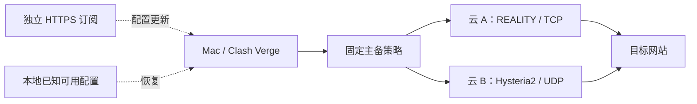

# Mac 网络代理方案深度对比与评分

后续供应商专项研究见 [VPS 服务商多维度比较与评分](2026-09-11-VPS服务商多维度比较与评分.md)：补齐 Vultr 官方 API 套餐价格、Hetzner 2026 年调价和六家服务商的采购评分。供应商具体价格以专项报告核对结果为准。

## 决策结论

对中国大陆个人使用、Mac 保留 Clash Verge、每月约 300 GB、1–3 台设备、月预算 $5–20、稳定性优先的场景，首选试验方向是：**两家云服务商的独立 VPS，提供 REALITY/TCP 与 Hysteria2/UDP 路径，使用固定主备策略，并保留离线配置。** 如果希望先降低成本和操作量，则从单台 REALITY 开始，随后添加同机 Hysteria2，最后再增加第二家云。

这是基于故障隔离、协议机制、官方兼容性和价格作出的架构判断，不是当前本地线路测速排名。城市、运营商、宽带与移动网络差异仍未知；候选机房必须经过七天本地测试才能成为正式主线路。任何方案都不能仅凭协议名称获得“不会封”“全天稳定”或“保证解锁”的结论。

本报告给八种明确架构计算六维评分，最高为双云双协议 79/100，同机双协议 73/100，单机 REALITY 66/100。**分数不是在线率或成功概率**，1–3 分的差距通常没有决策意义；关键维度的一档判断变化即可改变排名。

对于第三方托管订阅，没有具体运营商、套餐条款和同网络测试记录时不强行给总分；“托管订阅 + 自建备份”保留为条件候选。既有订阅包含多少条节点链接，不能证明有多少独立主机、出口或故障域。

## 范围与证据标准

资料核对截至 2026-09-11。价格按公开页面显示币种保留，不使用优惠券、试用余额、长期预付款折算价或未经验证的汇率。成本计算默认实例运行完整计费周期；税、域名、快照和人工单列。

评估分为四层：线路供应商提供机房和网络；协议决定连接方式；Clash/Mihomo 决定本机路由；订阅与面板负责配置分发。四层不能混为一个“协议好不好”的问题。

| 证据等级 | 内容 | 可支持的结论 | 不支持的结论 |
| --- | --- | --- | --- |
| A | 同行评审原始研究 | 已观察到的机制及其适用条件 | 2026 年某个 IP 的实时可达性 |
| B | 官方协议、产品、计费文档 | 功能、计费规则、实现约束 | 不经实测的本地速度与稳定性 |
| C | 可追溯的一手个人案例 | 值得验证的现象或线索 | 普遍优劣与长期成功率 |
| J | 本报告的评分、成本模型、工程推断 | 可复算的条件比较 | 把判断当作测量结果 |

研究资料以官方协议文档、云计费页和 USENIX 原始论文为核心。中文社区线索没有形成同运营商、同服务器、同负载的对照实验，因此不参与技术优劣评分。未获得本地线路实测数据；也未购买 VPS、登录代理商后台、修改客户端或使用既有节点凭证做联网测试。

## 影响选型的关键事实

### 1. 裸 SS 的易部署不等于长期适用

USENIX Security 2023 的原始研究记录了自 2021 年起对全加密流量的被动识别和阻断，涉及 Shadowsocks、VMess、Obfs4 等协议。这足以否定“字节看起来随机就无法识别”的假设，但不能推导任何 SS 节点此刻一定不可用，也不能用三年前的实验量化今天的阻断概率。[1](https://www.usenix.org/conference/usenixsecurity23/presentation/wu-mingshi)

因此，裸 SS 仍可作为教学、链路验证或可信隧道内的组件；在稳定性优先的公网直连场景中，不应因为设置最少就成为唯一长期入口。此前的 SS 部署模板可保留，推荐顺序需要据此修正。

### 2. REALITY 提供 TLS 外观，但并无永不失效的保证

Project X 将 REALITY 描述为修改 TLS、借助目标站外观和握手特征的传输安全机制。Mihomo 的 VLESS 文档提供 REALITY 与 Vision 相关配置字段，因此当前官方功能层面有兼容依据；具体二进制版本仍需校验。[2](https://xtls.github.io/en/config/transports/reality.html)、[3](https://wiki.metacubex.one/config/proxies/vless/)

推荐先试常见的 VLESS + REALITY + TCP/RAW + Vision 组合，不等于认为项目中全部新传输组合都已被当前 Mac 内核支持。官方页面中的性能倍数属于项目陈述，缺少本场景对照实验，不采用这些倍数评分。

REALITY 的目标站可达性、服务端设置和 IP 线路仍是依赖。官方还提示未认证流量转发到目标站可能带来滥用，部署时应关注目标选择与回落流量限制。[2](https://xtls.github.io/en/config/transports/reality.html)

### 3. Hysteria2 的优势取决于 UDP 和实际带宽

Hysteria2 是基于 QUIC 的 TCP/UDP 代理。当前文档说明其拥塞控制包含 BBR、Reno 和 Brutal；Brutal 依赖准确的带宽设置，设置高于实际能力可能使连接变慢、不稳并浪费流量。[4](https://v2.hysteria.network/docs/developers/Protocol/)、[5](https://hysteria.network/docs/advanced/Full-Server-Config/)

这支持把它作为与 TCP 路径互补的候选，不能支持“丢包环境必然最快”。如果本地网络阻断或严重限制 UDP，协议能力无法弥补入口不可达。Mihomo 提供 Hysteria2 配置支持。[6](https://wiki.metacubex.one/config/proxies/hysteria2/)

### 4. 同机双协议与双云解决不同故障

同机 REALITY + Hysteria2 可以在 TCP/UDP 之间选择，却仍共享 IP、主机、机房和供应商账户。不同供应商、不同地区的两个 VPS 才能减少这些共同故障；客户端和本地宽带依然是共同依赖。这是拓扑推断，不是测出的可用性提升百分比。

Mihomo 的 `fallback` 会在当前节点超时时按列表顺序选择可用节点。检测 URL 只代表该目标的可达性，已有长连接也不因此自动无损迁移。[7](https://wiki.metacubex.one/config/proxy-groups/fallback/)

### 5. 套餐写着相同 TB 数，实际容量可能不同

DigitalOcean 的 Droplet 入站免费、出站消耗额度，额外出站 $0.01/GiB。Lightsail 的入站与出站均消耗额度，超额收费针对符合条件的出站流量。因此代理下载的一份数据在 Lightsail 上通常同时产生一份入站和一份出站额度消耗。[8](https://docs.digitalocean.com/platform/billing/bandwidth/)、[9](https://docs.aws.amazon.com/lightsail/latest/userguide/amazon-lightsail-faq-data-transfer-allowance.html)

300 GB 的终端有效流量，在单跳代理下可粗估为约 300 GB VPS 出站与约 300 GB 入站，另加协议与重传开销。不能把这些粗估数字直接当账单，也不能把多跳链路的每一跳计费漏掉。

### 6. 普通 CDN 不是任意代理协议的免费转发器

Cloudflare 普通网络代理支持 WebSocket；其 Spectrum 文档说明 Pro/Business 仅支持选定协议，任意 TCP/UDP 的范围属于 Enterprise 能力。不能给域名打开代理开关，就认为裸 SS、REALITY 或 Hysteria2 流量都能通过。[10](https://developers.cloudflare.com/network/websockets/)、[11](https://developers.cloudflare.com/spectrum/get-started/)

CDN + WebSocket 是另一个完整传输方案，需要匹配客户端与服务端，也增加域名、TLS、CDN 配置和回源依赖。功能支持不等于任意用途与流量都符合所选服务条款。仅用 CDN 托管小型订阅文件，也不会改善真正的代理数据线路。

## 六维评分方法

采用 1–5 分量表，分数越高越符合本场景。总分计算为：

`总分 = Σ(维度分 × 权重) / 5`

| 维度 | 权重 | 定义和评分锚点 |
| --- | ---: | --- |
| R 故障隔离 | 30% | 1：单主机单入口；2：同机不同传输或入口；3：同供应商多出口可选；4：跨供应商独立节点；5：再有独立本地接入与恢复演练 |
| A 传输适配 | 20% | 1：本方案无额外外观适配；2：有替代/混淆机制但适用性证据或控制受限；3：有 QUIC 或 WebSocket/TLS 路径但偏单类传输；4：可配置的 TLS 外观 TCP 路径；5：组合互补 TCP 与 QUIC/UDP 路径 |
| O 运维省心 | 15% | 1：多层且复杂；2：维护多个协议/主机或 CDN 链；3：一个较多参数服务；4：简单单服务或成熟组网管理；5：运营商负责服务器，终端使用官方客户端 |
| C 基础现金成本 | 15% | 5：≤$7/月；4：>$7 且 ≤$12；3：>$12 且 ≤$20；2：>$20 且 ≤$35；1：>$35。参考明确构型，不包含个人工时 |
| K Clash 工作流 | 10% | 1：本次所选实现主要走另一客户端；2–4：存在额外配置/版本约束；5：Mihomo 标准节点和 YAML 工作流 |
| U 自主管理 | 10% | 1：无法导出和控制；2：托管出口；3：引入额外控制面或代理层；4：出口自有但依赖外部组网控制面；5：自己掌握服务和可迁移配置 |

A 是工程适配判断，不是抗识别实验得分；R 是故障结构，不是在线率。K 针对表内选定实现，例如“Mullvad 官方客户端”，不表示 Mihomo 没有 WireGuard 支持；Mihomo 目前也有 Tailscale 配置页。[12](https://wiki.metacubex.one/config/proxies/wg/)、[13](https://wiki.metacubex.one/config/proxies/tailscale/)

U 衡量控制权，不是匿名性或隐私审计。自建仍需信任云服务商和本机，且固定出口可能更容易关联使用行为。

评分假设：自建单机以 DigitalOcean $6 构型核算；双云以 DigitalOcean $6 + Lightsail $7 核算；CDN-WebSocket 假设 VPS $6 加域名摊销等后为 $7–12；Mullvad 按 €5、其价格页展示的美元近似值落在 ≤$7 档，仅用于分档，不作为锁定汇率报价。机房可用性、配额和地区选择都须采购时确认。[14](https://www.digitalocean.com/pricing/droplets)、[15](https://aws.amazon.com/lightsail/pricing/)、[16](https://mullvad.net/en/pricing)

## 八种方案评分表

| 方案 | R | A | O | C | K | U | 总分 /100 | 适用判断 |
| --- | ---: | ---: | ---: | ---: | ---: | ---: | ---: | --- |
| 两家云 + REALITY/Hysteria2 互补路径 | 4 | 5 | 2 | 3 | 5 | 5 | **79** | 稳定性优先的首选试验目标 |
| 单台 VPS 同机 REALITY + Hysteria2 | 2 | 5 | 2 | 5 | 5 | 5 | **73** | 成本较低的过渡方案，仍有主机单点 |
| 单台 VPS + REALITY/TCP | 1 | 4 | 3 | 5 | 5 | 5 | **66** | 最值得先部署验证的单协议方案 |
| 单台 VPS + Hysteria2 | 1 | 3 | 3 | 5 | 5 | 5 | **62** | UDP 条件好时可作主线或性能备选 |
| Mullvad 官方客户端 | 3 | 2 | 5 | 5 | 1 | 2 | **62** | 省运维，但需接受另一客户端与本地可达性验证 |
| 单台 VPS + 裸 SS | 1 | 1 | 4 | 5 | 5 | 5 | **57** | 入门/基线，不推荐唯一长期入口 |
| 单台 VPS + WebSocket/TLS + CDN | 2 | 3 | 2 | 4 | 4 | 3 | **56** | 仅在实测证明有收益后采用 |
| 单台自有 VPS + Tailscale 官方客户端出口 | 1 | 2 | 4 | 5 | 1 | 4 | **51** | 更偏组网和远程访问，非本场景首选 |

自建条目的 R/U 主要是拓扑与所有权事实；A/O 是基于文档机制和维护对象数量的判断；C 来自具体成本假设；K 来自官方节点支持。所有方案的本地晚高峰吞吐、实际丢包、网站接受度均为“未测”，没有将未知填写成高分。

### 逐项评分理由

**双云双协议：79。** R=4 因为两家独立供应商减少账户、单机和部分机房故障耦合，未解决本地宽带单点所以不给 5。A=5 因为 TCP 与 UDP 可选。O=2 因为两台服务器、证书/密钥和升级均需维护。C=3 对应 $13 基础月费；K/U=5 对应标准配置和自主管理。若两个节点共享同一中转入口，应降低 R。

**同机双协议：73。** 与双云相比，故障域仍集中于一台服务器，所以 R=2；省下一台 VPS 使 C=5。O=2 是对双协议参数、监听、日志和升级矩阵的保守估计。这个构型的高分来自互补能力与预算，并不声称能承受 IP 或主机整体不可达。

**单机 REALITY：66。** 单入口 R=1；其 TLS 外观和 TCP 路径给 A=4；较裸 SS 增加目标、公钥、短 ID、指纹/流控匹配，O=3。K=5 基于 Mihomo 官方文档，前提是使用相匹配的稳定版本和字段。[2](https://xtls.github.io/en/config/transports/reality.html)、[3](https://wiki.metacubex.one/config/proxies/vless/)

**单机 Hysteria2：62。** R=1，QUIC/UDP 单类底层路径 A=3；证书、带宽控制和 UDP 排障使 O=3。证书可自动管理不代表不需要监控。协议文档支持其设计能力，没有足以将其在所有本地网络中排在 REALITY 之前的受控数据。[4](https://v2.hysteria.network/docs/developers/Protocol/)、[5](https://hysteria.network/docs/advanced/Full-Server-Config/)

**Mullvad 官方客户端：62。** 多出口可选但由单一运营商管理，R=3；服务器维护交由运营商，O=5；按当前价格落入 C=5。K=1 是保持原 Clash 工作流的代价，不是产品总体质量差。其 2026-04-22 更新的官方限制网络指南写明中国场景亚洲服务器受阻，并建议尝试美国和混淆方式；据此将 A 保守记为 2，不能把全球 VPN 评价直接搬到大陆本地网络。[16](https://mullvad.net/en/pricing)、[17](https://mullvad.net/en/help/connecting-to-mullvad-vpn-from-restrictive-locations)

**裸 SS：57。** 服务与参数较少，O=4；标准 Clash 支持、自主管理和单机成本较好。R=1，A=1 则反映本构型没有额外传输外观适配及已有识别研究，不能通过低价和易部署消除这两个短板。[1](https://www.usenix.org/conference/usenixsecurity23/presentation/wu-mingshi)

**CDN-WebSocket：56。** CDN 添加入口但源站仍单点，R=2；单类 WS/TLS 路径 A=3。TLS 终止、回源和 CDN 设置增加维护与信任对象，因此 O=2、U=3；K=4 表示传输细节需要额外匹配。CDN 服务与回源都属于需监控的依赖，不能将其包装成“免费且无条件稳定”。[10](https://developers.cloudflare.com/network/websockets/)、[11](https://developers.cloudflare.com/spectrum/get-started/)

**Tailscale 官方客户端 + 自建出口：51。** 单出口 VPS 仍给 R=1；组网管理较成熟，O=4；外部控制面使 U=4，选用独立客户端使 K=1。官方说明 DERP 中继通常比直连慢且吞吐上限可能更低，因此其组网便利不能直接换算成高吞吐跨境线路优势。[18](https://tailscale.com/docs/reference/connection-types)

### 权重敏感性与不确定性

| 方案 | 稳定优先 | 省心优先 | 成本优先 |
| --- | ---: | ---: | ---: |
| 双云双协议 | 79 | 69 | 73 |
| 同机双协议 | 73 | 67 | 79 |
| 单机 REALITY | 66 | 67 | 75 |
| 单机 Hysteria2 | 62 | 64 | 72 |
| Mullvad 官方客户端 | 62 | 72 | 72 |
| 裸 SS | 57 | 65 | 69 |
| CDN-WebSocket | 56 | 54 | 62 |
| Tailscale 自建出口 | 51 | 59 | 63 |

省心权重为 R/A/O/C/K/U = 20/15/35/15/10/5；成本权重为 20/15/15/35/10/5。省心情景中 Mullvad 领先，仍须先通过本地可达性测试；若“必须全部在 Clash 内使用”是硬条件，则排除选用其他客户端的构型，而不是靠总分抵消硬条件。

稳定优先下，R 变动一档影响 6 分，A 一档影响 4 分，O/C 一档各影响 3 分。若双云实际上没有独立入口，R 从 4 降到 3，其总分即变成 73，与同机双协议持平。这是敏感性演示，不能称为统计置信区间。

## 第三方订阅、混合方案与其他协议

### 托管订阅：证据不足时不赋总分

托管订阅的实际质量取决于具体供应商，而不是订阅文件里写 SS、VLESS 还是 Trojan。公开推荐榜、节点数量和“专线”“原生 IP”等营销词不足以证明入口独立性、晚高峰容量或退出机制。没有服务条款和实测证据时，这一类标为 N/A，不用主观中间分伪装成事实。

可评估的资料至少包括：可公开确认的套餐与流量口径、设备数限制、退款/停用条款、历史状态记录、支持渠道、节点传输格式，以及本地七天试用记录。广告返佣推荐不作为唯一采购依据。

| 第三方候选的验收项 | 必需证据 |
| --- | --- |
| 300 GB 是否够用 | 流量倍率、上下行计费、重置周期 |
| 是否存在备用入口 | 不同入口与出口的可验证关系，故障切换实测 |
| 是否能继续使用 Clash | 实际 YAML/代理集合内容，当前内核校验 |
| 晚高峰是否可靠 | 同一终端、同一网络、连续多天的成功率和耗时 |
| 退出成本 | 月付、导出配置、取消续费流程和条款 |

**托管主线 + 独立自建备用**可能减少日常运维并保留自控出口。必须保证备用 VPS 不需要先通过托管主线才能连上，否则主线失效时备份也无效。成本按“订阅实价 + VPS $6–7”计算；供应商未指定，不给虚构合计或正式总分。

### Trojan、TUIC 与面板如何放进方案

Trojan 是可考虑的 TLS 类替代，Mihomo 有标准节点文档；已有有效部署且实测正常时，不必仅为追新迁移。TUIC 也有官方配置支持，可作为 QUIC 路线备选，但目前没有本场景同硬件对照数据支持它优于 Hysteria2。Hysteria2 + TUIC 都依赖 UDP，不能代替 TCP + UDP 的互补组合。[19](https://wiki.metacubex.one/config/proxies/trojan/)、[20](https://wiki.metacubex.one/config/proxies/tuic/)

3x-ui 用于管理节点和订阅，Sub-Store 用于组织与转换配置；它们不创造更好的公网线路。面板可能降低日常操作成本，也增加一个需要更新、备份和限制访问的服务。单人少量节点优先采用可复现配置，节点或账号规模上来后再评估面板。[21](https://github.com/MHSanaei/3x-ui)、[22](https://github.com/sub-store-org/Sub-Store)

## 云服务商：可验证的采购比较

| 云服务商/构型 | 官方核对到的价格和额度 | 适用角色 | 主要限制 |
| --- | --- | --- | --- |
| DigitalOcean Basic Regular 1 GiB | $6/月，1 vCPU，25 GiB 磁盘，1,000 GiB transfer；超额出站 $0.01/GiB | 起步主机或主备中的一台 | 本地到具体区域的质量未知；短期开机额度按存续时间累积 |
| Lightsail Linux 公网 IPv4 1 GB | $7/月，40 GB 磁盘，标称 2 TB transfer；若干地区为半额 | 第二家云或已有 AWS 账户时起步 | 入出站均消耗额度；超额出站价格显著高于 DO |
| Hetzner Singapore | 官方地区页列出出站额度范围 0.5–5 TB，取决于套餐 | 实测候选，特别关注流量口径 | 本次未取得稳定可核对的具体 SKU 价格；不可套用欧洲大流量宣传 |
| Vultr | 官方动态价格页本次未能读取；不采用第三方 $5 报价替代 | 地区测试候选 | 需在官方控制台核对 IPv4、SKU、流量和总价 |

来源：[8](https://docs.digitalocean.com/platform/billing/bandwidth/)、[14](https://www.digitalocean.com/pricing/droplets)、[15](https://aws.amazon.com/lightsail/pricing/)、[23](https://www.hetzner.com/cloud-singapore/)、[24](https://www.vultr.com/pricing/)。Vultr 的流量计费机制另有官方说明。[25](https://docs.vultr.com/support/platform/billing/how-is-bandwidth-usage-calculated)

DigitalOcean 官方价格页已标注 2026 年起按秒计费并有最低计费要求。试用几天时，不能假设已经获得完整月额度。Lightsail 的部分地区额度减半，应按实例所在区域的规则核对。[8](https://docs.digitalocean.com/platform/billing/bandwidth/)、[14](https://www.digitalocean.com/pricing/droplets)、[15](https://aws.amazon.com/lightsail/pricing/)

DigitalOcean 对 Droplet 的 SLA 为单实例月度 99.99% 及相应条款。它衡量供应商定义的基础设施服务，不覆盖本地宽带、跨境路径、客户端规则、网站限制的全部链路，不能拿 SLA 作为代理在线率预测。[26](https://www.digitalocean.com/sla/cpu-droplets)

因此不提供“云厂商速度 9.5/10”之类没有测量基础的评分。供应商采购依据是报价透明度、额度、地区和可恢复性；线路排名另做现场测试。

### 300 GB 与高流量情景

| 构型 | 基础月费 | 300 GB 有效流量的粗估 | 扩容注意 |
| --- | ---: | --- | --- |
| 一台 DO $6 | $6 | 约 300 GB 出站加开销，满周期下低于 1,000 GiB 额度 | 日志、测速、重传仍需统计 |
| 一台 Lightsail $7 | $7 | 约 600 GB 入出站合计加开销 | 半额地区和大流量场景需特别核对 |
| DO + Lightsail | $13 | 流量分配到实际使用的节点，不假设跨云共享额度 | 备用也保持开机；不需故意刷满额度 |
| 托管 + 自建备用 | 订阅实价 + $6–7 | 按两边规则各自计算 | 节点倍率和多跳开销需另计 |

以上是单跳、上下行近似对应的预算估计，不是精确计量。建议留出 20% 的规划余量，这个比例是预算假设，不是固定协议开销。双云 $13 可在 $20 内留下约 $7 用于域名摊销、备份或流量余量；税费或付费监控仍可能使总额超预算。

对于超额风险，用“额外被计费的出站 100 单位”比较更清楚：DO 的 100 GiB 对应 $1；Lightsail 新加坡的 100 GB 对应 $12，东京的 100 GB 对应 $14。GB 与 GiB 不同，而且 Lightsail 的额度消耗规则也不同；这些只是超额单价演示，不能直接套成相同有效下载量的账单。[8](https://docs.digitalocean.com/platform/billing/bandwidth/)、[9](https://docs.aws.amazon.com/lightsail/latest/userguide/amazon-lightsail-faq-data-transfer-allowance.html)

总成本应另加人工：`月等效成本 = 现金费用 + 维护小时 × 个人时间价值 + 预计中断损失`。例如按 1 小时/月、¥100/小时计，仅维护时间就是 ¥100；这是个人估价示例，不是云服务商收费。更便宜的 VPS 并不必然更省钱。

## 推荐的两阶段验证与部署架构

先只在两台之间选择一条 TCP、一条 UDP，减少首次验证的变量。如果 UDP 在备用网络不可达，则给第二台也增加 TCP 路径。双云双协议并不要求第一天就在每台机器部署所有协议。

订阅控制面与数据面分离：订阅下载失败时已保存配置应仍可工作；一台代理不可用时另一台不应依赖它转发。订阅配置使用独立令牌，不包含服务器 SSH 私钥，也不与节点密码复用。

端口要提前规划：REALITY 若占用同一 IP 的 TCP 443，Caddy 订阅服务不能同时直接绑定它；可把订阅放独立主机/地址或其他合理端口。TCP 443 与 UDP 443 可以分别用于不同服务，但 Hysteria2 证书获取方式仍需单独设计，不能靠端口可共存就省略证书验证。

### 阶段一：七天选线实验

| 时间 | 工作 | 产出 |
| --- | --- | --- |
| 第 0 天 | 确认运营商、真实应用、目标网站和预算；准备无凭证模板 | 固定测试条件 |
| 第 1 天 | 两个短期 VPS 部署；分别验证本地直达、代理请求、出口和证书 | 基础可用候选 |
| 第 2–3 天 | 相同终端轮流测 TCP/UDP，工作日白天与 20:00–23:00 | 时段对照数据 |
| 第 4–5 天 | 手机热点复测；测试浏览、API、下载和真实应用 | 网络与业务覆盖 |
| 第 6 天 | 停主进程、停主 VPS、停订阅端点，分别测试恢复 | 故障恢复记录 |
| 第 7 天 | 比较数据与费用，保留合格主备、删除无效资源 | 可复核选型决定 |

公平比较优先控制服务器硬件、测试 URL、文件大小、并发和时间窗口；网络质量随时间变化时交替测试，不能拿一个方案白天的数据与另一个晚高峰数据比较。不要同时跑大流量测速造成相互争抢。

### 稳定性的实际指标

| 指标 | 推荐测法 | 建议起步门槛（J） |
| --- | --- | --- |
| 请求成功率 | 每条候选独立代理端口/固定策略，每 5 分钟请求两个不同目标 | ≥99%，按目标和网络分别统计 |
| HTTPS 总耗时 | 记录 p50/p95 和超时，不只看最低延迟 | 固定小页面 p95 <3 秒，可按业务调整 |
| 持续吞吐 | 受控 100 MB 文件、重复短测 | 满足业务；1080p 使用可先设 ≥10 Mbps 为目标 |
| 长连接体验 | 真实会议或其他长会话 | 30 分钟内无不可接受的中断 |
| 切换恢复 | 主节点失效后请求恢复 | 目标 ≤120 秒，实际取决于检测间隔与应用重连 |
| 配置恢复 | 停订阅服务、恢复本地备份 | 已有节点仍可使用；新机恢复目标 ≤30 分钟 |
| 费用 | 云账单/用量、流量告警 | 300 GB 模型内，现金合计不超预算 |

以上门槛是建议的验收目标，不是任何供应商承诺。五分钟探测七天约 2,016 次/目标；99% 相当于最多约 20 次失败，但短间隔内的中断可能漏测，样本有时间相关性，不能据此外推年度 SLA。

测试节点时必须固定到被测节点，避免 fallback 自动转到别处导致“失败节点也测成功”。上线后的总体可用性测试则应开启真正的主备组。这两类记录要区分。

记录字段建议：`timestamp, network, provider, region, protocol, client_version, server_version, target, http_status, total_ms, bytes, exit_ip_match, error, selected_node`。公开报告只保存候选代号与聚合指标，不保存订阅令牌、密码和真实节点链接。

### 有数据后再更新评分

部署前使用本报告的架构分；试用后分别报告实际成功率、p95、吞吐、恢复时间、花费和维护工时。首先按硬门槛淘汰失败方案，再在合格方案中排序，不能让廉价高分抵消基本不可用。

如果需要一个试用后综合分，可采用 `实际验收分 × 60% + 架构分 × 40%`，但必须事先公开实际验收分如何归一化。当前实际验收分缺失，禁止代填，禁止把架构 79 分写成实测 79 分。

## 监控、升级和运维的比较

| 工作 | 单机 | 双云 | 托管/混合 |
| --- | --- | --- | --- |
| 进程与系统更新 | 自己负责 | 两套错峰升级 | 托管部分运营商负责，自建部分自己负责 |
| 证书与密钥 | 检查单套 | 每台独立，避免一次轮换影响全部 | 需要分别跟踪来源与到期 |
| 流量与费用 | 一家账单 | 两家分别告警 | 额外关注订阅倍率与续费 |
| 端到端监控 | 本地常开设备 | 每个节点和主备组都测 | 供应商状态页不能替代本地探测 |
| 恢复 | 重建单主机 | 切到备用后修复主机 | 保留可独立连接的备份 |

建议每 60 秒探测上线主备链路，三次连续失败再提醒，恢复后通知；上线时分别演练主节点、订阅和本地客户端故障。日志设置容量限制，凭证备份加密并放到 VPS 外。升级先备份，校验配置，单台升级并验证后再改另一台。

Clash 系统代理与 TUN 的覆盖范围不同；多个 VPN/TUN 客户端同时开启时，路由与 DNS 冲突会成为新的故障因素。备用官方 VPN 应有明确的启停操作，而不是让它与 Clash 一直争用全局路由。

多节点不自动等于隐私更好，住宅 IP 标签也不自动等于安全或目标网站接受。自建主要增加配置、日志和迁移控制权，托管主要转移运维负担，选择时要承认各自的信任边界。

## 证据冲突、资料缺口与推荐边界

- 2023 年 SS 研究是历史机制证据，不能当成 2026 年全量阻断率；REALITY/Hysteria2 官方设计目标也不能当成不会失效的保证。
- 中文视频中存在 Hysteria2 游戏体验改善的一手描述，但未形成可复现、同条件的比较；不将个案延迟数字用于评分。
- Mullvad 的公开限制网络指南给出亚洲入口受阻提示，但没有当前所在城市的测试；这支持谨慎试用，不支持声称全球所有入口都不可用。
- Vultr 动态官方价格本次未成功读取，Hetzner 的具体地区 SKU 价格未可靠提取，因此保留候选但不编造报价。
- 个别检索结果出现内容与目标项目不一致，未作为依据；不能仅凭搜索页的项目名或星数确认技术事实。
- 尚无当前 Mac 的内核版本、实际网络运营商和七天测量。应先验证兼容与线路，再决定正式购买；不承诺现有订阅转换即可恢复服务。

**采购顺序建议：先验证一台 $6–7 的 REALITY 候选，再在另一家云验证互补路径；仅当两条路径均通过本地测试时形成 $13 左右的双云基础构型。** 若维护工时超出预期，则转向可月付试用的托管方案加独立备份。预算不足或只需偶尔使用时，同机双协议可作为阶段性选择，但保留主机单点的事实。

## 来源与对应事实

以下在线来源访问日期均为 2026-09-11；未标注发布日期的页面属于持续更新文档。编号在正文链接旁对应，作者/发布者、标题和用途如下。

1. Mingshi Wu 等，USENIX Security 2023，2023-08，[How the Great Firewall of China Detects and Blocks Fully Encrypted Traffic](https://www.usenix.org/conference/usenixsecurity23/presentation/wu-mingshi)。原始研究，支持全加密流量存在识别机制。
2. Project X，[REALITY](https://xtls.github.io/en/config/transports/reality.html)。TLS 外观、配置、目标与回落约束。
3. MetaCubeX，[VLESS](https://wiki.metacubex.one/config/proxies/vless/)。Mihomo REALITY/VLESS 兼容字段。
4. Hysteria 项目，[Protocol](https://v2.hysteria.network/docs/developers/Protocol/)。QUIC 代理机制。
5. Hysteria 项目，[Full Server Config](https://hysteria.network/docs/advanced/Full-Server-Config/)。拥塞控制与带宽设置边界。
6. MetaCubeX，[Hysteria2](https://wiki.metacubex.one/config/proxies/hysteria2/)。客户端支持。
7. MetaCubeX，[自动回退](https://wiki.metacubex.one/config/proxy-groups/fallback/)。按顺序选择可用节点。
8. DigitalOcean，页面标注核验于 2026-07-13，[Bandwidth Billing](https://docs.digitalocean.com/platform/billing/bandwidth/)。入出站、超额费用、额度累积。
9. AWS，[Data transfer in Lightsail](https://docs.aws.amazon.com/lightsail/latest/userguide/amazon-lightsail-faq-data-transfer-allowance.html)。双向额度与区域超额费用。
10. Cloudflare，[WebSockets](https://developers.cloudflare.com/network/websockets/)。普通代理 WebSocket 支持。
11. Cloudflare，[Get started with Spectrum](https://developers.cloudflare.com/spectrum/get-started/)。不同计划的 TCP/UDP 协议范围。
12. MetaCubeX，[WireGuard](https://wiki.metacubex.one/config/proxies/wg/)。区分协议支持与官方 VPN 客户端路径。
13. MetaCubeX，[Tailscale](https://wiki.metacubex.one/config/proxies/tailscale/)。客户端集成存在，具体版本需验证。
14. DigitalOcean，[Droplet Pricing](https://www.digitalocean.com/pricing/droplets)。$6/1 GiB 等构型与计费方式。
15. AWS，[Amazon Lightsail Pricing](https://aws.amazon.com/lightsail/pricing/)。$7/1 GB IPv4 套餐和地区额度。
16. Mullvad，[Pricing](https://mullvad.net/en/pricing)。€5/月，页面汇率展示仅作参考。
17. Mullvad，更新于 2026-04-22，[Using Mullvad VPN in restrictive locations](https://mullvad.net/en/help/connecting-to-mullvad-vpn-from-restrictive-locations)。供应商关于中国入口与混淆的限制说明。
18. Tailscale，[Connection types](https://tailscale.com/docs/reference/connection-types)。DERP 相对直连的性能限制。
19. MetaCubeX，[Trojan](https://wiki.metacubex.one/config/proxies/trojan/)。替代协议支持。
20. MetaCubeX，[TUIC](https://wiki.metacubex.one/config/proxies/tuic/)。QUIC 类替代配置支持。
21. MHSanaei，[3x-ui](https://github.com/MHSanaei/3x-ui)。面板、节点管理和订阅能力。
22. Sub-Store 项目，[Sub-Store](https://github.com/sub-store-org/Sub-Store)。订阅管理工具定位。
23. Hetzner，[Cloud Singapore](https://www.hetzner.com/cloud-singapore/)。地区出站流量额度范围。
24. Vultr，[Pricing](https://www.vultr.com/pricing/)。本次读取受阻，仅保留官方采购入口，不作为已验证价格依据。
25. Vultr，[How Is Bandwidth Usage Calculated?](https://docs.vultr.com/support/platform/billing/how-is-bandwidth-usage-calculated)。出站计费机制。
26. DigitalOcean，[CPU Droplet SLA](https://www.digitalocean.com/sla/cpu-droplets)。单实例基础设施 SLA 范围。

评分数据另存为同目录 `2026-09-11-网络代理方案评分.json`，包含权重、逐项分数、成本假设与三种情景结果，可独立复算。没有包含既有订阅链接或节点凭证。
